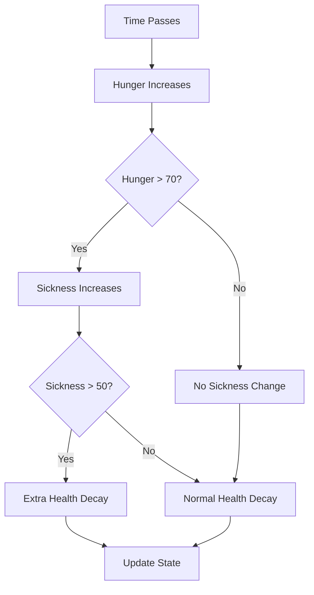
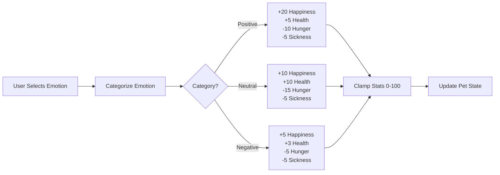
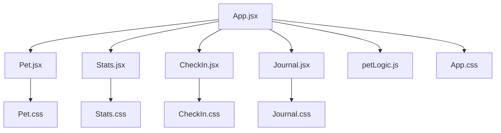

# Design Document

## Overview

This design document outlines the technical approach for transforming the Emotional Pet application into AuraPet with a desktop-focused layout, expanded stat system, and differentiated emotional impacts. The changes will maintain the existing React component architecture while enhancing the data model, UI layout, and game mechanics.

## Architecture

### Current Architecture
The application follows a simple React component hierarchy:
- `App.jsx` - Root component managing state and orchestrating child components
- `Pet.jsx` - Visual representation of the pet with mood-based display
- `Stats.jsx` - Display of pet statistics with progress bars
- `CheckIn.jsx` - Emotion selection interface
- `Journal.jsx` - Text entry form for journaling
- `petLogic.js` - Utility functions for state management and persistence

### Architectural Changes
No major architectural changes are required. The existing structure supports the enhancements through:
1. Expanding the state model in `petLogic.js`
2. Updating component rendering logic to handle additional stats
3. Modifying CSS for desktop-optimized layout
4. Enhancing the emotion-to-stat mapping logic

## Components and Interfaces

### Data Model Changes

#### Enhanced Pet State
```javascript
{
  health: number,        // 0-100
  happiness: number,     // 0-100
  hunger: number,        // 0-100 (NEW)
  sickness: number,      // 0-100 (NEW)
  mood: string,
  lastCheckIn: timestamp,
  lastJournal: timestamp,
  journalEntries: array,
  createdAt: timestamp
}
```

#### Default State Updates
- `hunger`: Initialize at 30
- `sickness`: Initialize at 0
- Update `STORAGE_KEY` to 'aurapet-state'

### Component Updates

#### Stats.jsx
**Changes:**
- Add two new stat displays for hunger and sickness
- Maintain consistent visual styling with existing stats
- Use appropriate emoji indicators (🍽️ for hunger, 🤒 for sickness)
- Consider visual hierarchy: health and happiness remain primary stats

**Layout Consideration:**
- Display stats in a 2x2 grid for desktop layout
- Maintain single column for mobile responsiveness

#### App.jsx
**Changes:**
- Update title from "Emotional Pet 🌟" to "AuraPet 🌟"
- Modify `handleCheckIn` to implement emotion-based stat changes
- Modify `handleJournalEntry` to affect all four stats
- Update document title via `useEffect` or index.html

**Emotion Mapping Logic:**
```javascript
const emotionEffects = {
  positive: ['happy', 'excited', 'grateful'],
  neutral: ['calm', 'neutral'],
  negative: ['sad', 'anxious', 'angry', 'frustrated', 'tired']
};

function getEmotionCategory(emotion) {
  if (emotionEffects.positive.includes(emotion)) return 'positive';
  if (emotionEffects.neutral.includes(emotion)) return 'neutral';
  return 'negative';
}

function applyEmotionEffects(state, emotion) {
  const category = getEmotionCategory(emotion);
  const effects = {
    positive: { happiness: +20, health: +5, hunger: -10, sickness: -5 },
    neutral: { happiness: +10, health: +10, hunger: -15, sickness: -5 },
    negative: { happiness: +5, health: +3, hunger: -5, sickness: -5 }
  };
  return applyStatChanges(state, effects[category]);
}
```

#### CheckIn.jsx
**Changes:**
- Update mood options to align with emotion categories
- Ensure moods include: happy, excited, grateful, calm, neutral, sad, anxious, angry
- Update emoji and labels accordingly

#### Pet.jsx
**Changes:**
- Update `getPetMood` logic to consider all four stats
- Prioritize health and sickness for visual state
- Add hunger-based messages ("I'm hungry...")
- Add sickness-based visual indicators

**Mood Calculation Logic:**
```javascript
function getPetMood() {
  if (sickness > 50) return 'sick';
  if (health < 30) return 'unhealthy';
  if (hunger > 70) return 'hungry';
  if (happiness < 30) return 'sad';
  if (health > 70 && happiness > 70 && hunger < 30) return 'happy';
  return 'neutral';
}
```

#### petLogic.js
**Changes:**
- Update `STORAGE_KEY` to 'aurapet-state'
- Modify `defaultPetState` to include hunger and sickness
- Enhance `updatePetHealth` to implement complex decay mechanics:
  - Hunger increases by 2 per hour
  - When hunger > 70, sickness increases by 1 per hour
  - When sickness > 50, health decreases by 2 per hour (in addition to base decay)
  - Happiness and health continue base decay of 1 per hour

**Decay Logic:**
```javascript
function updatePetHealth(state) {
  const now = Date.now();
  const hoursSinceLastCheckIn = (now - state.lastCheckIn) / (1000 * 60 * 60);
  
  // Base decay
  let healthDecay = hoursSinceLastCheckIn * 1;
  let happinessDecay = hoursSinceLastCheckIn * 1;
  let hungerIncrease = hoursSinceLastCheckIn * 2;
  let sicknessIncrease = 0;
  
  // Calculate new hunger first
  const newHunger = Math.min(100, state.hunger + hungerIncrease);
  
  // If hungry, increase sickness
  if (newHunger > 70) {
    sicknessIncrease = hoursSinceLastCheckIn * 1;
  }
  
  // Calculate new sickness
  const newSickness = Math.min(100, state.sickness + sicknessIncrease);
  
  // If sick, additional health decay
  if (newSickness > 50) {
    healthDecay += hoursSinceLastCheckIn * 2;
  }
  
  return {
    ...state,
    health: Math.max(0, state.health - healthDecay),
    happiness: Math.max(0, state.happiness - happinessDecay),
    hunger: newHunger,
    sickness: newSickness
  };
}
```

### Layout Changes

#### App.css
**Desktop Layout Strategy:**
- Change `max-width` from 600px to 900px
- Add media query for screens > 1200px to add horizontal padding
- Consider two-column layout for larger screens:
  - Left column: Pet display and stats
  - Right column: Check-in and journal interface
- Maintain single-column layout for mobile (< 800px)

**Responsive Breakpoints:**
```css
/* Mobile: < 800px - single column, current behavior */
/* Tablet: 800px - 1200px - wider single column */
/* Desktop: > 1200px - two-column layout option */
```

#### Stats.css
**Grid Layout:**
- Implement CSS Grid for 2x2 stat display on desktop
- Maintain vertical stack on mobile
- Ensure consistent spacing and alignment

## Error Handling

### Stat Boundary Enforcement
- All stat update functions must clamp values between 0 and 100
- Implement helper function: `clampStat(value) => Math.max(0, Math.min(100, value))`
- Apply to all stat modifications in `handleCheckIn`, `handleJournalEntry`, and `updatePetHealth`

### LocalStorage Migration
- Existing users will have old state structure without hunger/sickness
- Implement migration logic in `loadPetState`:
  ```javascript
  if (!saved.hunger) saved.hunger = 30;
  if (!saved.sickness) saved.sickness = 0;
  ```

### Decay Calculation Edge Cases
- Handle cases where `lastCheckIn` is in the future (clock changes)
- Cap maximum decay to prevent extreme stat drops after long absences
- Consider maximum decay window (e.g., 24 hours max)

## Testing Strategy

### Unit Testing Focus
- `petLogic.js` functions:
  - `updatePetHealth` with various time intervals
  - Stat clamping behavior
  - State migration logic
- Emotion categorization logic
- Stat effect calculations

### Integration Testing
- Check-in flow with different emotions
- Journal entry submission
- Decay system over time intervals
- LocalStorage persistence and retrieval

### Manual Testing Scenarios
1. **Desktop Layout**: Verify layout at 800px, 1200px, and 1920px widths
2. **Stat Interactions**: Test hunger → sickness → health cascade
3. **Emotion Variety**: Verify each emotion category produces correct stat changes
4. **Boundary Conditions**: Test stats at 0, 50, and 100 values
5. **Time Decay**: Simulate time passage and verify decay rates
6. **Migration**: Test with old localStorage data structure

### Visual Regression Testing
- Pet mood states with new stat combinations
- Stats display with four bars
- Responsive layout at different breakpoints
- Check-in button grid with updated emotions

## Implementation Notes

### Phased Approach
1. **Phase 1**: Data model and logic updates (petLogic.js, stat calculations)
2. **Phase 2**: Component updates (Stats, Pet, CheckIn, App)
3. **Phase 3**: Layout and styling (CSS updates for desktop)
4. **Phase 4**: Branding updates (titles, README, storage keys)

### Backward Compatibility
- Maintain localStorage structure compatibility where possible
- Implement graceful migration for existing users
- Preserve existing journal entries and timestamps

### Performance Considerations
- Decay calculations run every minute - ensure efficiency
- Avoid unnecessary re-renders when stats don't change
- Consider memoization for emotion category lookups

## Mermaid Diagrams

### Stat Interaction Flow


### Emotion Impact Flow


### Component Hierarchy

